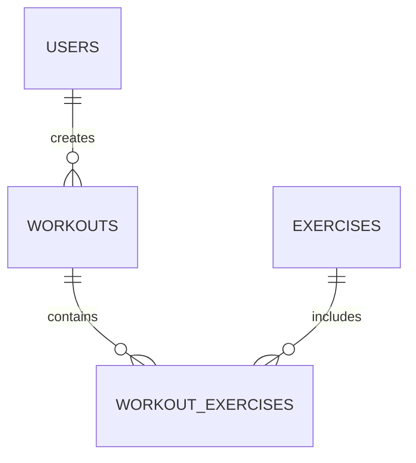

# Base de Datos

## Estructura

### Tablas Principales

```sql
-- Users
CREATE TABLE users (
  id UUID PRIMARY KEY,
  email VARCHAR NOT NULL,
  role VARCHAR NOT NULL,
  created_at TIMESTAMP DEFAULT NOW()
);

-- Workouts
CREATE TABLE workouts (
  id UUID PRIMARY KEY,
  user_id UUID REFERENCES users(id),
  name VARCHAR NOT NULL,
  description TEXT,
  level VARCHAR
);

-- Exercises
CREATE TABLE exercises (
  id UUID PRIMARY KEY,
  name VARCHAR NOT NULL,
  description TEXT,
  muscle_group VARCHAR[],
  difficulty VARCHAR
);
```

## Relaciones y Constraints



## Migraciones

Las migraciones se manejan con Prisma y se encuentran en `/prisma/migrations/`.

### Comandos Comunes

```bash
# Crear nueva migración
npx prisma migrate dev --name nombre_migracion

# Aplicar migraciones pendientes
npx prisma migrate deploy

# Reset de base de datos (solo desarrollo)
npx prisma migrate reset
```
